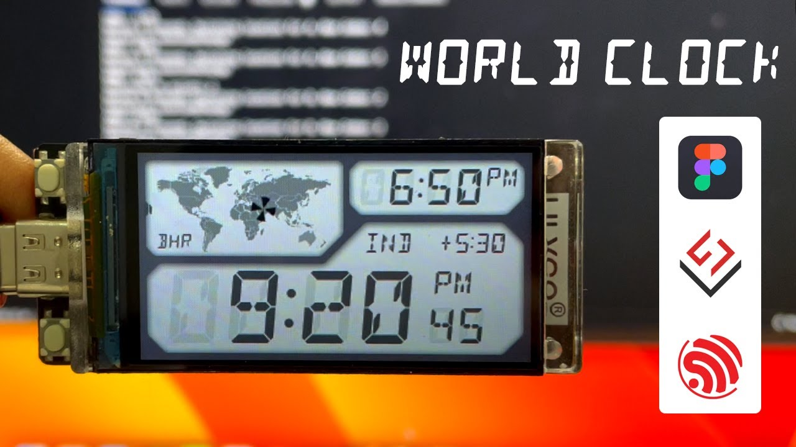

# Casio Style World Clock for T-Display-S3
Adapted from: https://github.com/nishad2m8/T-Display-S3-YT  
\
I was inspired by Nishad's excellent design to add additional functionality improving configurability and timekeeping.  

---


## Added Features:
- Automatic location / timezone detection from IP address
- Daylight Savings Time handling
- 12/24 hour time formats
- Logging with levels
- interactive WiFi SSID and password configuration (no hard-coded secrets)
- USB serial CLI with commands for the above
- Web CLI


## ToDo:
- Dynamic location list (interactive add location)
- Indicators for lock and format modes
- Improved battery operation

## Build
- Built using PlatformIO
- Must click on 'Upload Filesystem Image' under PlatformIO 'Project Tasks' to upload CLI web page file

## Run
- connect to the cli using something like `screen /dev/cu.usbmodem101 115200,cs8`
    - configure wifi credentials using `wifi <ssid> <password>`
- once wifi is started, cli may be accessed at http://clock.local

## CLI Commands
```
log                  - control logging, usage: log [ on | off | level {level} ]
mode                 - change modes, usage: mode [lock | map | prime | format | color], default next
next                 - choose next setting in current mode
location             - set location for clock, usage: location [ map | prime ] {code}
format               - set time format, usage: format [ show | 12 | 24 ]
wifi                 - (re)connect WiFi, usage: wifi [ssid pwd]
screen               - turn screen on or off, usage: screen [ on | off ]
wake                 - set wakeup trigger, usage: wake [ button | after {seconds} ]
sleep                - enter light sleep, usage: sleep
battery              - show or monitor battery voltage, usage: battery [ volts | show | monitor ( on | off | clear) ]
power                - show or set power level, usage: power [ low | high ]
cpu                  - show or set cpu speed, usage: cpu [ show | fast | slow ]
update               - update time from network (NTP)
fps                  - show display update FPS
uptime               - show uptime
web                  - control web CLI, web [ on | enable | off | disable | auth {id} {password} ]
reboot               - reboot the clock
```
